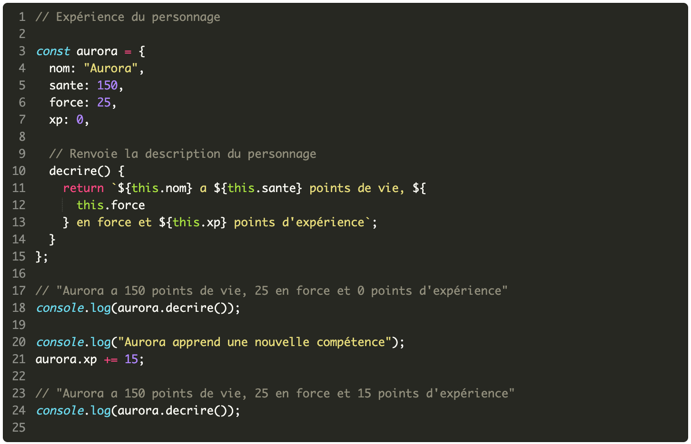
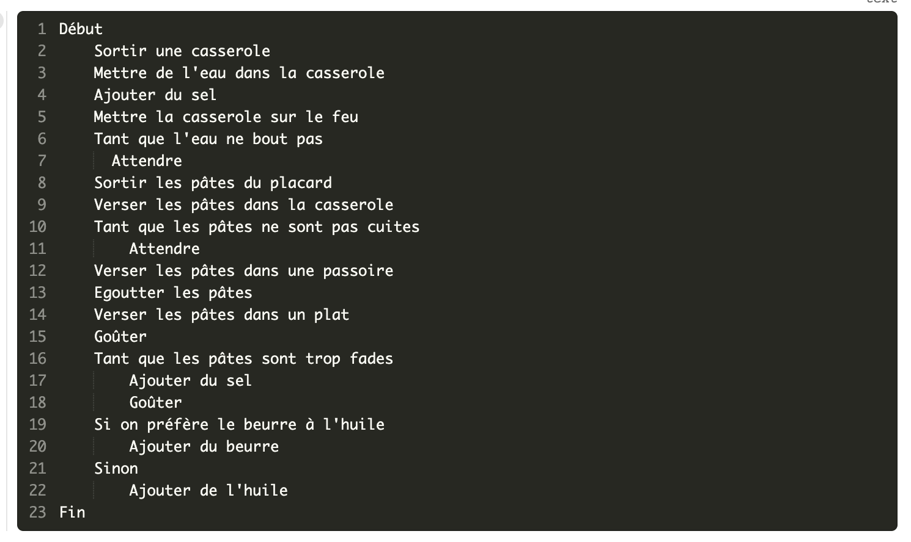
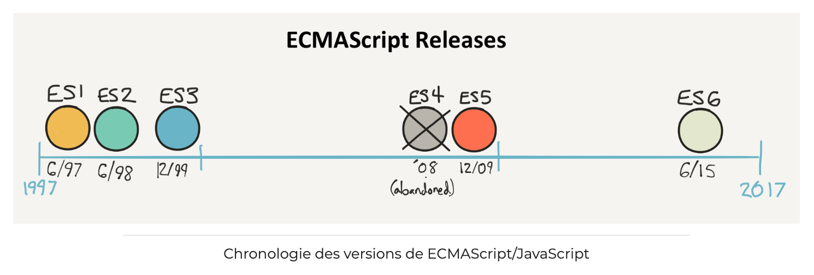

# JAVASCRIPT

Notes de cours provisoires

Basées notamment sur :

- Le tutoriel d'Openclassroom "Apprenez à coder avec JavaScript" (20 heures, facile) : https://openclassrooms.com/fr/courses/2984401-apprenez-a-coder-avec-javascript, en grande partie ;
- Le livre « Javascript pour les Web Designers » de Mat Marquis, Collection A Book Apart n° 20 aux Éditions Eyrolles, dans une moindre mesure.

# Partie 1 - Écrire ses premières lignes de code

## Introduction à la programmation

Un **ordinateur** est une machine qui se contente d'exécuter automatiquement, vite et sans erreur, les opérations qu'on lui demande d'effectuer.

Un **programme** est une liste d'ordres, de commandes, indiquant à un ordinateur ce qu'il doit faire.

Le rôle du programmeur (ou développeur) est de créer ces programmes.

Pour cela, il peut utiliser différents langages de programmation : assembleur, Ptython, php, Java, C, C++, JavaScript, …

Le langage de programmation définit la manière de donner les ordres à l'ordinateur. Tout langage a

- son vocabulaire (un ensemble de mots-clés, chacun jouant un rôle spécifique) ;
- sa grammaire (un ensemble de règles définissant la manière d'écrire des programmes dans ce langage).

Chaque langage a sa propre syntaxe mais les concepts sont les mêmes dans tous les langages : variables, fonctions, boucles, tests, … 

Chaque ligne de commande s'appelle une **instruction**.

L'ensemble des instructions d'un programme est appelée son **code source**.

Pour être compris par l'ordinateur, le programme doit respecter les règles du langage de programmation utilisé.

### La notion d'algortithme

On ne crée pas un programme en se lançant directement dans l'écriture du code source.

Avant d'écrire le programme, il faut analyser et décomposer le problème à résoudre en opérations élémentaires.

**L'algorithme** est la suite des opérations à réaliser pour résoudre le problème. 

Prenons un exemple tiré de la vie courante : je souhaite préparer un plat de pâtes. Quelles sont les étapes qui vont me permettre d'atteindre mon objectif ?

On peut imaginer la solution ci-dessous : 

On arrive à l'objectif visé en combinant un ensemble d'actions dans un ordre précis.

On peut distinguer différents types d'actions :

- des actions simples ("Sortir une casserole") ;
- des actions conditionnelles ("Si on préfère le beurre à l'huile...") ;
- des actions qui se répètent ("Tant que les pâtes sont trop fades...").

Un **algorithme** est une suite ordonnée d'opérations qui permet de résoudre un problème : il décompose un problème complexe en une suite d'opérations simples.

## Présentation de JavaScript

### Histoire de JavaScript

JavaScript est le langage de programmation du Web. Il a été inventé en 1995 par Brendan Eich, qui travaillait à l'époque pour la société *Netscape*, créatrice du premier navigateur Web populaire (l'ancêtre de Firefox). 

L'idée de départ était de créer un langage simple pour rendre dynamiques et interactives les pages Web, qui étaient très simplistes à l'époque.

Petit à petit, les créateurs de sites Web ont enrichi leurs pages en y ajoutant du code écrit en JavaScript. Ce langage a donc été progressivement intégré à l'ensemble des navigateurs Web, qui sont tous capables aujourd'hui d'exécuter du code JavaScript.

L'avènement du Web 2.0, basés sur des pages riches et interactive a rendu JavaScript de plus en plus populaire. Les concepteurs de navigateurs Web ont optimisé la rapidité d'exécution du code JavaScript, jusqu'à en faire un langage très performant. Cela a conduit à l'apparition en 2009 de la plate-forme Node.js, qui permet d'écrire en JavaScript des applications Web très rapides. Par l'intermédiaire de MongoDB, JavaScript a même pénétré le monde des bases de données (les logiciels qui ont pour rôle de stocker des informations de manière fiable et durable).

Enfin, l'arrivée des smartphones et autres tablettes dotés de systèmes différents et incompatibles (iOS, Android ou Windows Phone) a conduit à l'apparition d'outils de développement dits multi-plateformes. Ils permettent d'écrire en une seule fois des applications mobiles compatibles avec l'ensemble des terminaux du marché. Ces outils sont presque toujours basés sur... JavaScript !

### JavaScript : un langage essentiel

Historiquement créé pour animer les pages web, le langage JavaScript peut maintenant être utilisé pour programmer dans de très nombreux environnements : serveurs, applications mobiles, objets connectés... Il permet de faire de la programmation côté navigateur Web (on parle de *développement front-end*), côté serveur (*back-end*) ou côté mobile.

JavaScript est devenu essentiel pour de très nombreux développeurs. Il s'agit d'un excellent choix comme premier langage de programmation.

### Les versions de JavaScript

JavaScript a été standardisé en 1997 sous le nom d'ECMAScript. Depuis, le langage a subi plusieurs séries d'améliorations pour corriger certaines maladresses initiales et supporter de nouvelles fonctionnalités.

On verra dans ce cours d'abord la version ES5 de JavaScript pour les bases et puis on passera à ES6. Bien que récente, cette dernière version  est maintenant bien supportée par les navigateurs modernes.

### Navigateur requis

Pour suivre ce cours, vous devez disposer d'un navigateur web moderne comme Firefox, Chrome ou Microsoft Edge, mais PAS Internet Explorer.

## 3, 2, 1... Codez !

### Un premier programme

C'est le moment de faire vos premiers pas avec JavaScript ! Voici votre tout premier programme.

Afficher un texte à l'écran (le fameux "Hello World" bien connu des programmeurs) est souvent la première chose que l'on apprend à faire lorsqu'on découvre un nouveau langage. 

`console.log("Hello, World !");`

Pour le tester, il vous suffit de taper les instructions dans la console JavaScript de votre navigateur web.

L'instruction JavaScript `console.log()` permet d'afficher une information dans la console javascript d'un navigateur.

N.B. Il existe d'autres possibilités pour tester du code JavaScript :

* Utiliser un "bac à sable" en ligne, comme par exemple CodePen ;
* Installer la plate-forme Node.js sur votre ordinateur.

### Valeurs et types

Une **valeur** est un morceau d'information utilisé dans un programme informatique.

Les valeurs peuvent être de différents types : nombre, texte, booléen, … Le type d'une valeur détermine son rôle et les opérations qui lui sont applicables. 

Il y a des données de type simple (une seule valeur) et des données plus complexes comme les tableaux ou les objets, que nous verrons plus tard.

Commençons par les types simples, on dit aussi les types primitifs. 

#### TYPES PRIMITIFS

Voici les 5 types primitifs disponibles en JavaScript.

#### Le type nombre

Une valeur de type **nombre** (*Number* en anglais) représente une valeur numérique, autrement dit une quantité. 

Les nombres servent à compter.

Les opérations qu'on peut faire avec des valeurs de type nombre sont des opérations mathématiques, par exemple :

Ces opérations produisent un résultat de type nombre.

**Conseil** : faites un petit exercice avec l'opérateur `%`(**modulo**), que vous connaissez peut-être un peu moins bien : l'opérateur modulo donne le reste de la division entière d'un nombre par un autre.

Par exemple, tapez dans la console :

`4 % 2`, puis `9 % 2`, …

4 % 2 = 0 : lorsqu'on divise 4 par 2, on a 4 / 2 = 2 et il reste 0. On dit que 4 est divisible par 2, ou que 4 est un multiple de 2.

9 % 2 = 1 : lorsqu'on divise 9 par 2, si on se limite à la partie entière, on a 9 / 2 = 4 et il reste 1 (4 * 2 = 8 + 1  = 9). On dit que 9 n'est pas divisible par 2.

Le modulo permet donc de savoir si un nombre est divisible par un autre, autrement dit si un nombre est un multiple d'un autre : si le modulo vaut 0, c'est qu'on a un multiple. 

Le type Number possède quelques valeurs particulières, comme par exemple la valeur "`NaN`" (Not a Number, qui signifie "ce n'est pas un nombre") et la valeur "`Infinity`", qui représente l'infini (qui est ce que vous obtiendrez si vous essayez par exemple de diviser un nombre par 0).

#### Le type chaîne

Une valeur de type **chaîne de caractères** (en abrégé chaîne, ou *String* en anglais) représente un texte.

Ces valeurs sont délimitées par une paire de guillemets simples ou doubles :

`"Ceci est une chaîne"`

On ne peut pas additionner ou soustraire des valeurs de type chaîne comme on peut le faire avec des nombres.

Mais on peut appliquer l'opérateur `+` à deux valeurs de type chaîne. Appliqué à deux chaînes, l'opérateur `+`  fusionne les deux chaînes en une seule. Cette opération est appelée **concaténation**. 

Par exemple :

`"Bon"+"jour"` produit le résultat  "Bonjour".

N.B. Il est également possible de délimiter une chaîne de caractères avec une paire de guillemets simples :

`'Ceci est aussi une chaîne'`

Par convention, nous emploierons les guillemets doubles dans ce cours. L'important est d'être cohérent : utilisez l'une ou l'autre notation, mais ne mélangez pas les deux.

Il ne faut surtout pas oublier de "fermer" une chaîne : simples ou doubles, les guillemets vont toujours par deux !

Pour inclure dans une chaîne certains caractères spéciaux, on utilise le caractère `\` (qui se prononce "antislash" ou "backslash" en anglais) qui donne un sens particulier au caractère suivant. Par exemple, `\n` permet d'ajouter un retour à la ligne dans une chaîne.

#### Le type booléen

Le type **booléen** (*Boolean* en anglais) est un type de données logique qui ne possède que deux valeurs possibles : soit `true`, soit `false` (vrai ou faux, 0 ou 1).

#### Le type undefined

Le type **`undefined`** est le type attribué à une variable qui ne possède pas encore de valeur. 

#### Le type null

Le type **`null`** représente une non-valeur : un élément a été défini mais il n'a aucune valeur intrinsèque.

### Structure d'un programme

Un programme informatique se compose de plusieurs lignes de code, plusieurs ordres, qui s'exécutent successivement.

#### Instructions

Chaque ordre est appelé une **instruction**.

Une instruction est délimitée par un point virgule.

Un programme est donc une suite d'instructions.

#### Déroulement de l'exécution

Lorsqu'un programme est exécuté, les instructions qui le composent sont "lues" les unes après les autres.

Chaque instruction produit un résultat, et c'est la combinaison de ces résultats individuels qui produit le résultat final du programme.

Par défaut, les instructions s'exécutent toutes, les unes après les autres, dans l'ordre où elles osnt écrites dans le code.

Mais on pourra utiliser des **structures de contrôle** pour contrôler la manière dont les instructions vont s'exécuter :

- les tests (ou expressions conditionnelles) vont permettre de créer des branchements et de ne pas exécuter certaines instructions : si la condition est vraie, alors on exécute une instrucion, sinon, on en exécute une autre (c'est ce qu'on fera avec des instructions comme `if / else`, ou `switch` par exemple) ;
- les boucles vont permettre de répéter plusieurs fois une même instruction avant de passer à la suite (tant qu'une condition n'est pas remplie, on répète :   c'est ce qu'on fera avec des instructions comme `while`, ou `for`).

#### Commentaires

Les commentaires sont des portions de code non interprétées. Ils permettent de documenter le fonctionnement d'un programme.

En JS, on délimite les commentaires soit par // … pour commentaer une ligne, soit par /* … */ (comme en CSS) : 

## Jouez avec les variables

### La notion de variable

#### Rôle des variables

Un programme informatique mémorise des données en utilisant des variables. 

Une **variable** est une zone qu'on réserve dans la mémoire de l'ordianteur pour  stocker une information. On peut l'imaginer comme une boîte dans laquelle on range des choses. 

#### Propriétés d'une variable

Une variable possède trois propriétés :

- Son **identifiant** : c'est le **nom** que l'on donne à la variable, qui permet de l'identifier. Un identifiant de variable peut contenir des lettres majuscules ou minuscules, des chiffres (sauf en première position) et certains caractères comme le dollar ($)  ou le tiret bas, appelé underscore (_) ;
- Sa **valeur**, qui est la donnée actuellement mémorisée dans cette variable ;
- Son **type**, qui détermine le rôle et les opérations applicables à cette variable. 

En JavaScript, le type d'une variable est déduit implicitement de sa valeur, et non pas défini explicitement. Il s'agit d'un langage à typage dynamique.

#### Déclarer une variable

Avant de pouvoir stocker des informations dans une variable, il faut la créer. 

Cette opération (créer la variable) s'appelle la **déclaration** de la variable.

Au niveau de l'ordinateur, quand on déclare une variable, on réserve en fait une zone dans la mémoire de l'ordinateur qui va être attribuée à cette variable. 

On déclare une variable JavaScript avec le mot-clé `var` (ou, en ES6, le mot-clé `let`) suivi du nom de la variable.

Par exemple, en ES5 : 

	var firstName;
	
ou, en ES6 :

N.B. Si la valeur de la variable n'est pas destinée à changer, on utilisera de préférence le mot-clé `const` pour déclarer une variable constante.

Si on affiche une variable juste après l'avoir déclarée, on peut voir que le résultat affiché est `undefined`.

`undefined` est un type JavaScript qui indique l'absence de valeur.

Immédiatement après sa déclaration, une variable JavaScript n'a pas de valeur, ce qui est logique puisqu'on n'a pas encore stocké de valeur dans cette variable.

#### Affecter une valeur à une variable

Pour donner une valeur à une variable, on utilise l'opérateur `=`, appelé opérateur d'**affectation**.

La ligne `a = 3.14` se lit « a **reçoit** la valeur 3,14 ». À présent, la variable contient la valeur 3,14. 

On peut également combiner déclaration et affectation de valeur en une seule ligne, on parle alors d'**initialisation** de variable (initialiser une variable = la déclarer et lui affecter une valeur en une seule ligne de code) :

#### Incrémenter une variable de type nombre

Dans le cas d'une variable de type nombre, on peut utiliser l'opérateur  `+=` pour augmenter la valeur de la variable. 

    var a = 0;        // a contient 0
    a += 2;           // a contient 2
    console.log(a);   // 2

Si on veut augmenter la valeur de la varaible de 1 unité, on peut aussi utiliser l'opérateur `++`. L'opérateur `++` est appelé opérateur d'**incrémentation**, car il permet d'incrémenter (augmenter de 1) la valeur d'une variable. `++` est donc équivalent à `+= 1`

    var a = 0;        // a contient 0
    a += 1;           // a contient 1
    console.log(a);   // 1
    var b = 0;        // b contient 0
    b ++;             // b contient 1
    console.log(b);   // 1 

#### Portée d'une variable

La portée (*scope* en anglais) d'une variable représente la portion du code source dans laquelle cette variable est utilisable.

Une variable déclarée avec `var` peut avoir deux types de portée : **locale** ou **globale** :

- si elle est déclarée en dehors d'une fonction, sa portée est globale : elle est accessible partout dans l'application ;
- si elle est déclarée à l'intérieur d'une fonction, sa portée est locale : elle n'est utilisable QUE à l'intérieur de cette fonction.

Une variable déclarée avec `let` et `const` a une **portée de bloc** : elle n'est utilisable qu'à l'intérieur du bloc de code dans lequel elle est définie.

Un bloc de code est délimité par une paire d'accolades ouvrante et fermante.

N.B. La notion de portée est une notion très importante, mais nous reverrons cela en détail un peu plus tard…

### La notion d'expression

Une expression est un morceau de code qui produit une valeur.

On crée une expression en combinant des variables, des valeurs et des opérateurs.

Par exemple : 

	2 + 3
	a = "toto"

- `2 + 3` est une expression qui combine la valeur `2`, l'opérateur `+` et la valeur `3`. On dit que
	- `2` et `3` sont des opérandes,
	- `+` est l'opérateur,
	- `2 + 3` est une opération ou une expression ;
- `a = "toto"` est une expression qui combine la variable `a`, l'opérateur d'affectation `=` et la valeur `"toto"`. On dit que
	- `a` et `"toto"` sont des opérandes,
	- `=` est l'opérateur,
	- `a = "toto"` est une opération ou une expression.

Une expression est donc généralement de la forme

`OPÉRANDE opérateur OPÉRANDE`

Une expression produit une valeur et correspond à un certain type.

Par exemple : 

- `2 + 3` produit la valeur 5 et est de type Number ;
- `a = "toto"` produit la valeur "toto" et est de type String.

Le calcul de la valeur d'une expression s'appelle l'**évaluation**. **Évaluer une expression**, c'est donc calculer la valeur de cette expression.

Par exemple, on dit que :

- l'expression `2 + 3` s'évalue à la valeur 5 ;
- l'expression `a = "toto"` s'évalue à la valeur "toto".

Lors de l'évaluation d'une expression, les variables sont remplacées par leur valeur.

#### Les opérateurs et la priorité des opérateurs

Il existe de nombreux opérateurs en JS : les opérateurs mathématiques, l'opérateur d'affectation, des opérateurs logiques, des opérateurs de comparaison, …

##### Les principaux opérateurs mathématiques

Nous les avons déjà vus : ils s'appliquent sur des données de type nombre et produisent un résultat de type nombre :

##### Les principaux opérateurs de comparaison

Ils produisent un résultat de type boléen.

N.B. `===` teste une égalité au sens strict : il ne renvoie `true` que si les deux données ont la même valeur ET le même type.

`==` est plus permissif : il teste seulement l'égalité des valeurs, pas de type.

La même différence existe entre `!==` et `!=`.

Par exemple :

- `2 === 2` vaut `true` (ce sont les mêmes valeurs et elles sont toutes les deux de type nombre) ;
- `2 === "2"` vaut `false` (ce sont les mêmes valeurs mais pas les même types — la première valeur est de type nombre et la deuxième est de type chaîne) ;
- `2 == "2"` vaut `true` (ce sont les mêmes valeurs et ça suffit, `==` ne teste pas l'éaglité des types)

##### Les opérateurs logiques

##### La priorité des opérateurs

On peut combiner plusieurs opérateurs dans la même expression. Dans ce cas, il faut détereminer quelle opération sera exécutée en premier lieu.

Par exmple, si on écrit l'expression `6 + 3 * 2`, quelle opération sera exécutée en premier lieu : `6 + 3`, ou `3 * 2` ? Cela change le réultat. Si c'est `6 + 3` d'abord, l'expression vaudra 9 * 2 = 18. Si c'est `3 * 2` d'abord, l'expression vaudra 6 + 6 = 12. Comment savoir ?

Chaque opérateur a un niveau de priorité. Si le niveau de priorité d'un opérateur est plus élevé, cet opérateur s'exécute avant celui qui a un niveau de priorité plus bas.

Voici la table qui reprend les niveaux de priorité des opérateurs en JS :

Par exemple, on voit que l'opérateur "Multiplcation" (`*`) a un niveau de priorité 14, alors que l'opérateur "Addition" (`+`) a un niveau de priorité 13. C'est donc l'opérateur `*` qui s'exécute d'abord, et puis ensuite l'opérateur `+`.

Dans notre expression `6 + 3 * 2`, c'est donc l'opération `3 * 2` qui s'exécute d'abord. Cette expression `3 * 2` s'évalue à la valeur 6. Et puis ensuite c'est l'opération `6 + 6` qui s'exécute et qui s'évalue à la valeur 12.

Si on veut changer l'ordre des opérations, on peut utiliser les parenthèses pour regrouper les opérandes et l'opérateur qui doivent s'exécuter en premier lieu, comme ceci :

`(6 + 3) * 2`

En effet, on peut voir dans le tableau que les parenthèses `(…)` sont un opérateur, l'opérateur de groupement, qui a la priorité 20, la plus élevée. Dans une expression, les parenthèses s'exécutent donc toujours en premier.

Dans notre exemple, cela donne `(6 + 3)` d'abord. Cette expression s'évalue à la valeur 9. Et puis l'opération `9 * 2` s'exécute et cette expression s'évalue à la valeur 18.

### Conversions de type

#### Conversion implicite

L'évaluation d'une expression peut entraîner des conversions de type. Ces conversions sont dites implicites : elles sont faites automatiquement, sans intervention du programmeur.

Par exemple, l'utilisation de l'opérateur `+` entre une valeur de type chaîne et une valeur de type nombre provoque la concaténation des deux valeurs dans un résultat de type chaîne.

Par exemple :

	var a = 100;
	console.log("a contient " + a);
	
L'expression `"a contient " + a` s'évalue à la chaîne de caractères "a contient 100".

Pourquoi ?

- l'opérande `"a contient "` est de type chaîne,
- l'opérateur (`+`) pourrait être soit un opérateur d'addition, soit un opérateur de concaténation,
- l'opérande `a` est de type nombre.  

JS ne sait pas additionner une chaîne et un nombre, c'est impossible. Quel fait-il donc ?

1. il convertit automatiquement la valeur de `a`(100), qui au départ est de type nombre, en une chaîne, "100" ;
2. il a à présent deux chaînes de caractères : "a contient " et "100". Il utilise donc le `+` comme opérateur de concaténation pour unir ces deux chaînes, ce qui donne la chaîne de caractères "a contient 100".

#### Et si la conversion implicite est impossible ?

Le langage JavaScript est extrêmement tolérant au niveau des conversions de type. Cependant, il arrive qu'aucune conversion ne soit possible.

Par exemple, si on essaie de faire 

	var a = "cinq" * 2;
	console.log(a);
	
JS est incapable de convertir la chaîne de caractères "cinq" en une valeur de type nombre (5) pour pouvoir la multilplier avec 2.

En cas d'échec de la conversion d'un nombre, la valeur du résultat est `NaN` (*Not a Number*).

#### Conversion explicite

On peut forcer la conversion d'une valeur dans un autre type. On parle alors de conversion explicite. Comment ?

- l'instruction `Number()`convertit la valeur placée entre parenthèses en un nombre ;
- l'instruction `String()` convertit la valeur placée entre parenthèses en une chaîne.

Par exemple :

	var a = "5";
	console.log(a + 1);  // Concaténation : l'expression s'évalue à 51
	
	var b = Number("5");
	console.log(b + 1);  // Addition : l'expression s'évalue à 6

### Interactions avec l'utilisateur

#### Saisie d'informations

L'instruction `prompt()` affiche une boîte de dialogue qui permet à un utilisateur d'entrer une information.

Par exemple, si on écrit

	prompt("Entrez votre prénom :");

on obtient la boîte de dialogue suiavnte, qui permet à l'utilisateur d'entrer son prénom : 

On peut récupérer la valeur entrée dans le champ par l'utilisateur en la stockant dans une variable, comme ceci :

	var prenom = 	prompt("Entrez votre prénom :");

**Attention**, quel que soit le texte saisi (même s'il s'agit d'un nombre), l'instruction `prompt()` renvoie toujours une valeur de type chaîne. Il faudra donc penser à convertir cette valeur avec l'instruction `Number()` si vous voulez la comparer à d'autres nombres ou l'utiliser dans des expressions mathématiques.

#### Affichage d'informations

L'instruction `alert()` permet d'afficher une information sous la forme d'une boîte de dialogue.

On pourrait par exemple, dire bonjour à la personne dans une boîte de dialogue, comme ceci :

	alert("Bonjour, " + prenom);

N.B. `prompt()` et `alert()`ne fonctionnent que dans le contexte d'un navigateur web.

### Importance du nommage des variables

#### Choisir des noms significatifs

#### Bannir les caractères accentués et les caractères spéciaux

#### Ne pas utiliser les noms réservés du langage

Les mots-clés du langage JavaScript sont des noms réservés. Ils ne doivent pas être utilisés comme noms de variables. 

Voici les mots réservés en JS :

Vous les trouverez aussi dans la référence du MDN : 

Notez que votre éditeur de texte préféré vous aide à les repérer grâce à la coloration syntaxique…

#### Adopter une convention de nommage

On a intérêt à adopter une convention de nommage, c'est-à-dire une manière uniforme d'écrire les noms de toutes les variables. Il en existe plusieurs.

La plus fréquemment utilisée est la norme camelCase (appelée parfois lowerCamelCase). Elle repose sur deux grands principes :

- tout nom de variable commence par une lettre minuscule ;
- si le nom d'une variable se compose de plusieurs mots, la première lettre de chaque mot (sauf le premier) s'écrit en majuscule.

Par exemple, les noms `montantTravauxMaison` ou `codeClientSuivant` respectent la norme camelCase.

